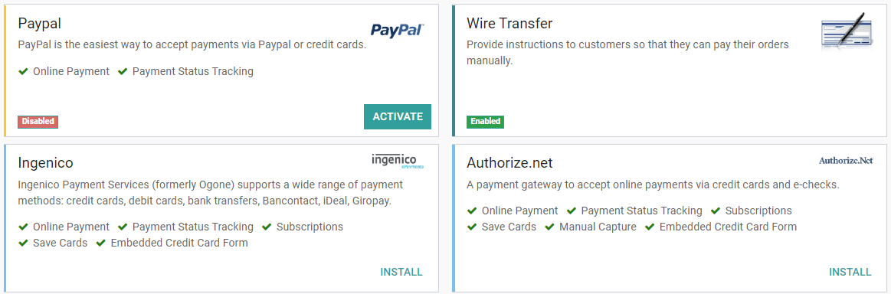

=================================================
Payment Acquirers (Credit Cards, Online Payments)
=================================================

Odoo embeds several **payment methods** that allow your customers to pay on their *Customer Portals*
or your *eCommerce website*. They can pay Sales Orders, invoices, or subscriptions with recurring
payments with their favorite payment acquirers, including **online payment providers** that accept
**Credit Cards**.

Having several payment methods increases the chances of getting paid in time, or even immediately,
as you make it more convenient for your customers to pay with the payment method they prefer and
trust.

.. image:: media/payment-acquirers-online-payment.png
   :align: center
   :alt: Pay online in the customer portal and select which payment acquirer to use.

.. important::
   Odoo does not keep any Credit Card information or credentials on its servers, nor is it stored on
   Odoo databases hosted elsewhere. Instead, Odoo apps use a unique reference to the data stored in
   the payment acquirers' systems, where the information is safely stored.

Payment Acquirers
=================

From an accounting perspective, we can distinguish two types of payment acquirers: the payments that
go directly on the bank account and follow the usual reconciliation workflow, and the payment
acquirers that are third-party services and require you to follow another accounting workflow.

- Bank Payments

  - | :doc:`Wire Transfer <wire_transfer>`
    | When selected, Odoo displays your payment information with a payment reference. You have to
      approve the payment manually once you have received it on your bank account.
  - | SEPA Direct Debit
    | Your customers can sign a SEPA Direct Debit mandate online and get their bank account charged
      Directly. :doc:`Click here <../../accounting/receivables/customer_payments/batch_sdd>` for
      more information about this payment method.

- Online Payment Providers

  - Adyen
  - AliPay
  - :doc:`Authorize.Net <authorize>`
  - Buckaroo
  - Ingenico
  - :doc:`Paypal <paypal>`
  - PayU
  - PayUmoney
  - Sips
  - Stripe

.. note::
   Some of these Online Payment Providers can also be added as :doc:`Bank Accounts
   <../../accounting/bank/setup/bank_accounts>`, but this is *not* the same process as adding them
   as Payment Acquirers. Payment Acquirers allow customers to pay online, and Bank Accounts are
   added and configured on your Accounting app to do a bank reconciliation, which is an accounting
   control process.

Configuration
=============

Add a new Payment Acquirer
--------------------------

To add a new Payment acquirer and make it available to your customers, go to
:menuselection:`Accounting --> Configuration --> Payment Acquirers`, look for your payment acquirer,
install the related module, and activate it. To do so, open the payment acquirer and change its
state from *Disabled* to *Enabled*.

.. warning::
   We recommend using the *Test Mode* on a duplicated database or a test database. The Test Mode is
   meant to be used with your test/sandbox credentials, but Odoo generates Sales Orders and Invoices
   as usual. It isn't always possible to cancel an invoice, and this could create some issues with
   your invoices numbering if you were to test your payment acquirers on your main database.

Credentials tab
~~~~~~~~~~~~~~~

If not done yet, go to the **Online Payment Provider**'s website, create an account, and make sure
to have the credentials required for third-party use. Odoo requires these credentials to communicate
with the Payment Acquirer and get the confirmation of the *payment authentication*.

The form in this section is specific to the Payment Acquirer you are configuring. Please refer to
the related documentation for more information.

Configuration tab
~~~~~~~~~~~~~~~~~

You can change the Payment Acquirer front-end appearance by modifying its name under the **Displayed
as** field and which credit card icons to display under the **Supported Payment Icons** field.

Save and reuse Credit Cards
***************************

With the **Save Cards** feature, Odoo can store **Payment Tokens** in your database, which can be
used for subsequent payments, without having to reenter the payment details. This is particularly
useful for subscriptions' recurring payments.

.. note::
   The payment tokens stored on the database don't hold information about the credit cards used.

Place a hold on a card
**********************

If the **Capture Amount Manually** field is enabled, the funds are reserved for a few days on the
customer's card, but not charged yet. You must then go to the related Sales Order and manually
*capture* the funds before its automatic cancellation, or *void the transaction* to unlock the funds
from the customer's card.

Countries
*********

Restrict the use of the Payment Acquirer to a selection of countries. Leave this field blank to make
the Payment Acquirer available to all countries.

Payment Journal
***************

The **Payment Journal** selected for your Payment Acquirer must be a *Bank* journal.

.. important::
   In many cases, Odoo automatically creates a new **Journal** and a new **Account** when you
   activate a new Payment Acquirer. Both of them are preset to work out-of-the-box, but we strongly
   recommend you to make sure these fields are correctly set according to your accounting needs, and
   adapt them if necessary.

Messages tab
~~~~~~~~~~~~

Change here the messages displayed by Odoo after a payment's confirmation or failure.

Accounting perspective
======================

The **Bank Payments** that go directly to one of your bank accounts follow their usual
reconciliation workflows. However, payments recorded with **Online Payment Providers** require you
to consider how you will record your payments' journal entries. We advise you to ask your accountant
how you will proceed.

Odoo default method is to record the payments on a *Current Assets Account*, on a dedicated *Bank
Journal*, once the *Payment Authentication* is confirmed. At some point, you transfer the funds from
the *Payment Acquirer* to your *Bank Account*.

Here are the requirements for this to work:

- Bank Journal

  - The Journal's **type** must be *Bank Journal*.
  - Select the right **Default Debit Account** and **Default Credit Account**.
  - | Under the *Advanced Settings* tab, make sure that **Posting** is set as *Post At Payment
      Validation*.
    | This implies that the Journal Entry is recorded directly when your Odoo database receives the
      confirmation of the *Payment Authentication* from the Online Payment Provider.

- Current Asset Account

  - The Account's **type** is *Current Assets*
  - The Account must **Allow Reconciliation**

.. note::
   In many cases, Odoo automatically creates a new **Journal** and a new **Current Asset Account**
   when you activate a new Payment Acquirer.

.. seealso::

   - :doc:`../../accounting/receivables/customer_payments/recording`
   - :doc:`wire_transfer`
   - :doc:`authorize`
   - :doc:`paypal`